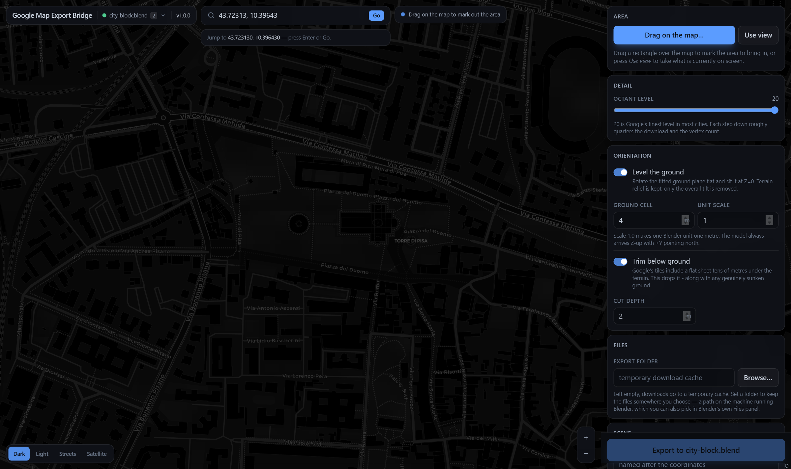
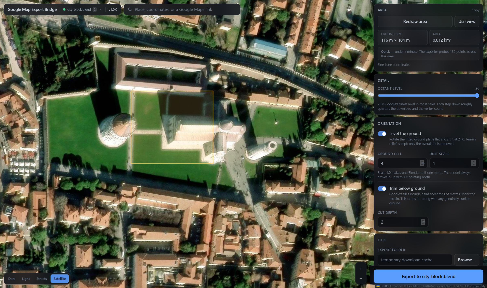
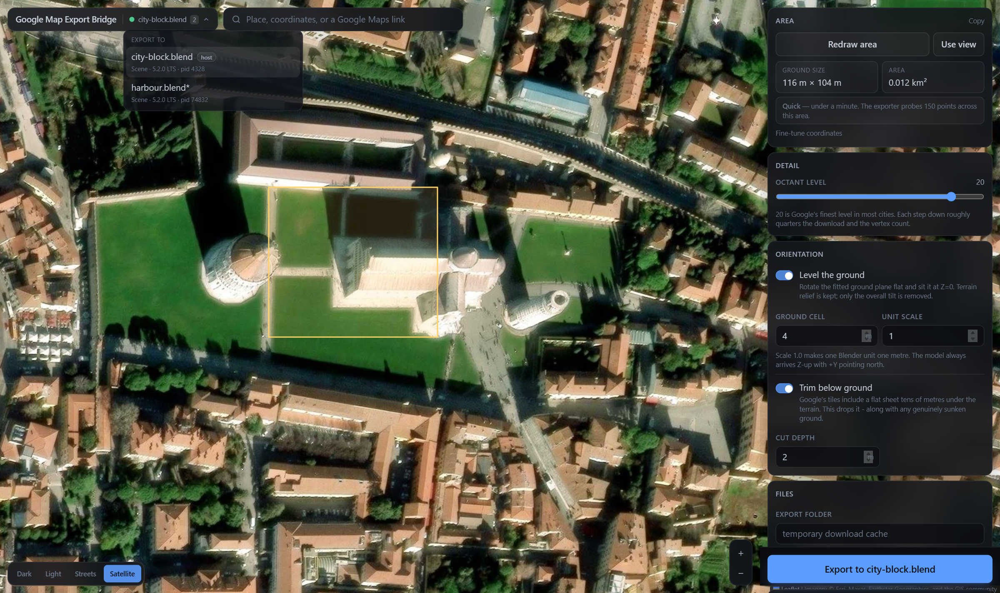
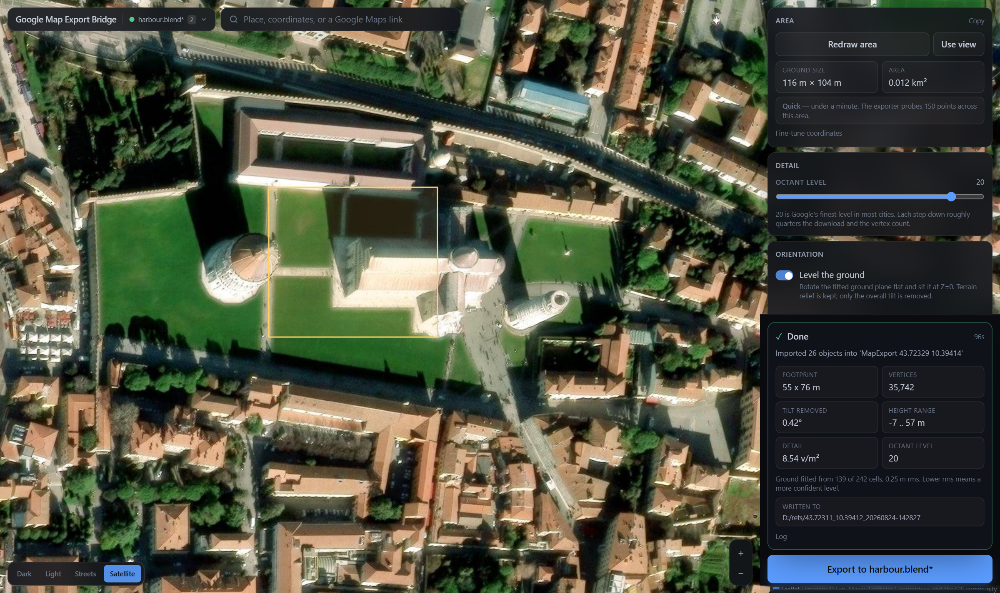
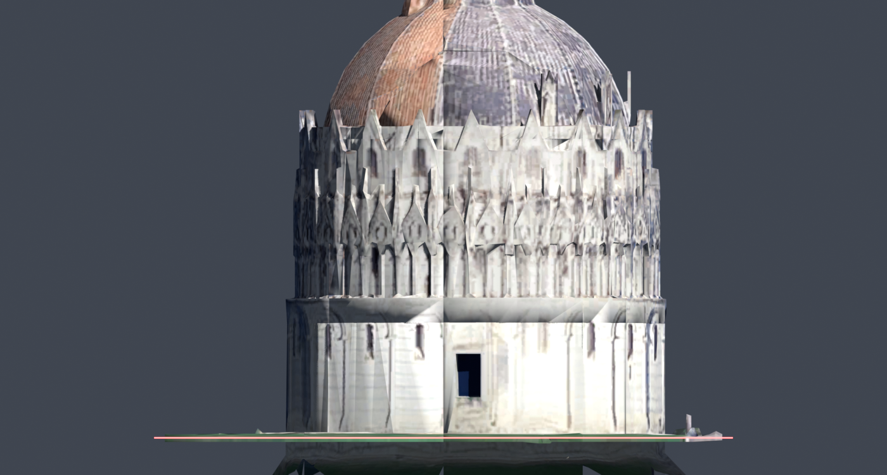
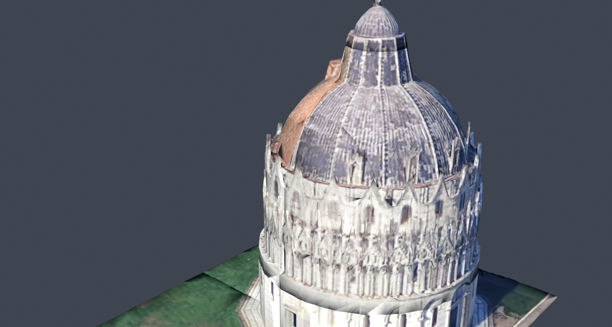

# Google Map Export Bridge

Pick an area on a map in your browser, press one button, and it arrives in the
Blender scene you chose — upright, at real-world scale, with the ground flat on
the floor.

## Built on

This project stands on two existing projects by
[**KIWIbird717**](https://github.com/KIWIbird717), and would not exist without
them:

| Project | What it does |
| --- | --- |
| [**Google-Earth-CLI-Exporter**](https://github.com/KIWIbird717/Google-Earth-CLI-Exporter) | Downloads Google Earth's 3D tiles for a bounding box. Vendored and bundled here as the add-on's exporter. |
| [**Map-Bridge-Web-Interface**](https://github.com/KIWIbird717/Map-Bridge-Web-Interface) | The browser map used to choose that bounding box, and the workflow this follows. |

**This project was meant to streamline the process of export and make it easier
to deploy for quality of life improvements.** Using those two tools together
meant running a CLI by hand, copying coordinates between a web page and a
terminal, then importing the result and fixing its orientation yourself. Here
the map, the export and the import are one button — and the two corrections that
make the output usable as a modelling reference happen automatically.

Also see [`NOTICE.md`](NOTICE.md) for full provenance, and the
[Google Earth disclaimer](#google-earth-data) below.

---

## Screenshots

Search by place name, coordinates, or a pasted Google Maps link:



Drag out the area you want. The panel shows the ground size and what the
download will cost before you commit:



Several Blender windows open at once? Pick which one receives the export:



When it finishes, the report tells you what actually arrived — footprint, vertex
count, how much tilt was removed, and where the files were written:



And the result in Blender. The red line is exactly `Z = 0`: the ground lies flat
along it and the Baptistery stands upright.





---

## The two corrections

### Orientation

The exporter writes vertices in Google's globe frame: earth-centred,
earth-fixed metres on a sphere of radius 6371 km. In that frame "up" at any
place is the radial direction, not `+Z`, so a raw import arrives tipped over by
roughly `90° − latitude` and spun by the longitude.

The fix is a rotation into the local **East / North / Up** frame at the model's
own centre, which lands exactly on Blender's convention: `+X` east, `+Y` north,
`+Z` up.

This also has to happen **before** Blender sees the file. Blender stores vertex
coordinates as float32, where the spacing between representable values at a
magnitude of 6.4 × 10⁶ is about half a metre — importing raw earth-centred
coordinates quantises the whole model into half-metre steps. So the transform is
done on the OBJ text in float64 and the rewritten file is what gets imported.

### Level ground

After the rotation the ground is still tilted, because a real hillside is
tilted and because the exported patch sits off to one side of the tangent point.
So the ground is found and rotated flat, then dropped to `Z = 0`.

Terrain relief is **kept** — only the overall tilt is removed. Google's mesh is
one continuous photogrammetry surface with buildings welded to the terrain, so
flattening the relief itself would squash the buildings along with it.

Finding "the ground" is the interesting part, because two things impersonate it:

- **Tile clip planes.** Google's tiles carry a flat sheet tens of metres *below*
  the terrain. Since the ground is sampled by taking the lowest point in each
  grid cell, this sheet is actively sought out — in testing it occupied a
  quarter of all cells.
- **Roofs**, in dense cities, where most cells never see the ground at all.

Candidate surfaces are therefore scored by how much geometry sits in the few
metres **directly above** them, and rejected if too much of the model lies
underneath. Real ground is continuous photogrammetry, so the band above it is
packed; a clip plane has a wide empty gap above it, and a roof has the whole
building below. [`tests/test_ground_fit.py`](tests/test_ground_fit.py) encodes
each failure case.

Measured on a Pisa export: ground level to within **0.05°** and sitting at
**Z = 0.03 m**.

---

## Install the add-on

**Requirements:** Blender 4.2+ and [Node.js](https://nodejs.org) 18+. Node runs
the bundled exporter; nothing else is needed.

1. Download the `.zip` from the
   [latest release](https://github.com/onlykshitij/Google-Earth-3D-to-Blender/releases/latest),
   or build it yourself with `python build.py`.
2. In Blender: **Edit → Preferences → Add-ons**, then the **⌄** menu at the top
   right → **Install from Disk…**, and choose the zip.
3. Enable **Google Map Export Bridge**.
4. Allow network access: **Preferences → System → Network → Allow Online
   Access**.
5. Press **N** in the 3D viewport and open the **Map Export** tab.

Press **Open Map** and the interface opens in your browser. Nothing else needs
to be running — the add-on serves it itself.

---

## Using it

Areas are always selected visually:

1. Get to the place. The search field takes any of three things:
   - a place name, geocoded through Nominatim,
   - coordinates — `43.7231, 10.3963` or `43°43'23.2"N 10°23'46.7"E`,
   - a **Google Maps link**, pasted straight from the address bar.
2. Press **Draw area** and drag a rectangle — or **Use view** to take what is on
   screen.
3. Check the estimate. The panel shows the ground size and how many points the
   exporter will probe, which is what download time actually tracks.
4. Press **Export to …**.

Progress runs both in the page and in Blender's own panel: downloading →
georeferencing → importing. The model lands in its own collection, locked so you
cannot nudge it while modelling against it.

> Shortened Maps links (`maps.app.goo.gl/…`) carry no coordinates — they only
> appear after a redirect the browser cannot follow. Open the link in Google Maps
> and copy the full URL instead.

### When Google has no 3D data

Google only has photogrammetry for part of the world. Elsewhere Earth falls back
to satellite imagery draped over coarse terrain, and the exporter returns that
quite happily — it imports without error, but it is a textured sheet with no
buildings on it.

Nothing in the data announces which kind you got, so it is inferred from three
measurements and reported plainly:

- **relief** — how far the tallest geometry rises above the fitted ground,
- **density** — vertices per square metre (level-20 photogrammetry runs to
  several; a terrain sheet is orders of magnitude below),
- **achieved level** — the deepest octant level Google actually had, which is
  often lower than the one you asked for.

You get either *No 3D coverage* ("draped imagery over flat terrain, with no
buildings") or *Thin coverage* with the numbers behind it. Both appear in the
page and in Blender's panel, so you know before you start modelling.

### Where the files go

By default downloads land in a temporary cache. Set an **Export folder** — in
the page's Files card, or with the folder picker in Blender's **Files** panel —
and each export gets its own dated subfolder there:

```
<your folder>/43.72311_10.39412_20260824-142827/
    model.obj             raw download, earth-centred metres
    model_blender.obj     the georeferenced file that gets imported
    model.mtl
    tex_*.bmp
```

Everything for one area sits together in one flat folder, so the imported
materials point at textures you can move, archive or version alongside the
`.blend`. The exporter's own `downloaded_files/obj/<timestamp>/` scaffolding is
cleared away afterwards.

A folder you chose yourself is never deleted, whatever the **Keep Downloads**
preference says. When no export folder is set and that preference is off,
textures are packed into the `.blend` before the cache is cleared so nothing
breaks.

### Several Blender windows at once

Every Blender running the add-on registers with one hub, so the page lists them
all and the header becomes a picker. The export goes to the one you select,
identified by its `.blend` name, scene, version and PID.

No setup is needed: the first Blender to start hosts the hub, the rest detect it
and join. If the hosting one is closed, another takes over within a few seconds.

---

## Deployment

Three ways to run the interface. They differ only in *where the hub lives* — the
downloading and importing always happen inside Blender, which owns the exporter
and the scene.

### 1. Inside Blender

Nothing to run. The add-on hosts the interface on `127.0.0.1:8777` and opens it
for you. Best for a single workstation.

### 2. The Python run script

```bash
python run.py
```

That is the whole thing: no dependencies beyond the standard library, no Blender
needed to start it. It prints a localhost URL, opens your browser, and waits for
Blender to check in.

```bash
python run.py --port 9000            # a different port
python run.py --no-browser           # do not open a browser
python run.py --host 0.0.0.0         # reachable from other machines
python run.py --agent-token "$(openssl rand -hex 24)"
```

Then in Blender: **Preferences → Add-ons → Google Map Export Bridge → Hub URL**,
set to the printed address.

Useful when you want the map to stay open across Blender restarts, or when
several people share one machine.

### 3. Docker Compose

```bash
docker compose up -d
```

The image is published by this repository's CI, so there is nothing to build —
Compose pulls it and starts the container. The interface is then at
<http://127.0.0.1:8777>, restarting with the daemon.

```bash
docker compose pull && docker compose up -d   # update
docker compose logs -f                        # watch
docker compose down                           # stop
```

Point each Blender's **Hub URL** preference at `http://127.0.0.1:8777`.

The image is ~75 MB and holds only Python's standard library and the built
interface — no Node.js and no Blender, because the container never does the work
itself. It is built for `linux/amd64` and `linux/arm64`.

<details>
<summary>Exposing it on a network</summary>

The Compose file publishes to `127.0.0.1` only, so out of the box the interface
is reachable from that machine and nowhere else. To share it, change the port
mapping to `"8777:8777"` and set a shared secret so only your Blenders can
register:

```bash
GMEB_AGENT_TOKEN=$(openssl rand -hex 24) docker compose up -d
```

Put the same value in each add-on's **Hub Token** preference, and set
`GMEB_PUBLIC_URL` to the address people should actually dial.

| Variable | Meaning |
| --- | --- |
| `GMEB_HOST` | bind address inside the container (`0.0.0.0`) |
| `GMEB_PORT` | port inside the container |
| `GMEB_PUBLIC_URL` | address Blender should use; must match the published port |
| `GMEB_AGENT_TOKEN` | shared secret Blender must present |
| `GMEB_NO_BROWSER` | `1` to not open a browser |

To build from this checkout instead of pulling, uncomment `build: .` in
`docker-compose.yml` and run `docker compose up -d --build`.

</details>

### Blender and the container both want port 8777

If a Blender with the add-on enabled is already running, **it is hosting the
interface itself** on `127.0.0.1:8777`, and `docker compose up` will fail with
*"port is already allocated"*.

That is worth knowing before reaching for Docker at all: the running Blender is
already serving the same interface at <http://127.0.0.1:8777>. The container is
only better if you want it to outlive Blender.

Order decides whether this happens. **Start the container first** and there is no
conflict at all — a Blender starting afterwards probes the port, finds the hub
already there, and joins it as a client. The clash only occurs the other way
round.

To move an already-running Blender onto the container:

1. Set **Hub URL** to `http://127.0.0.1:8777` in the add-on preferences. The
   add-on stops hosting, releases the port, and from then on only ever joins.
2. `docker compose up -d`

Or, to leave Blender hosting and put the container somewhere else:

```bash
GMEB_HOST_PORT=8778 docker compose up -d
```

Then set **Hub URL** to `http://127.0.0.1:8778`. `GMEB_PUBLIC_URL` follows the
port automatically.

For a one-off, the **X** button in Blender's Map Export panel disconnects and
frees the port immediately.

### Pointing Blender at any hub

**Hub URL** in the add-on preferences takes a full address, not just a port, so
the hub can live anywhere you can reach:

```
http://127.0.0.1:8777          the run script or a container on this machine
192.168.1.20:8777              another machine on your network
my-desktop:8777                by hostname
https://maps.example.com       behind a reverse proxy with TLS
```

The scheme and port are filled in when you leave them off, and the preferences
panel shows the address it resolved to. Leave the field empty to host the
interface inside Blender instead, in which case the **Hub Port** setting applies.

---

## How it fits together

```
   browser                     hub                      Blender
 ┌──────────┐            ┌─────────────┐            ┌──────────────┐
 │ map, draw│ ──POST───▶ │  registry   │ ◀──poll─── │ agent thread │
 │ an area  │ ◀─status── │  + commands │ ──cmds──▶  │              │
 └──────────┘            └─────────────┘            └──────┬───────┘
                    in Blender, run.py,                    │ main thread
                    or a container                         ▼
                                                    ┌──────────────┐
                                                    │ node exporter│
                                                    │ georeference │
                                                    │ + level      │
                                                    │ obj import   │
                                                    └──────────────┘
```

Blender is always the **client**. It polls out and never listens, which is what
lets the hub sit in a container that could not otherwise reach back into a
desktop process — and what gives the instance list for free.

Only the main thread touches `bpy`. The agent and the job worker run on their own
threads and hand work over through queues, because calling Blender's API off the
main thread corrupts it.

### Pipeline

1. `node exporter/earth-export.cjs --bbox=… --level=20` downloads the octant
   tree and writes `model.obj` in earth-centred metres, plus its textures.
2. [`obj_transform.py`](google_map_export_bridge/obj_transform.py) streams that
   file three times: accumulate the centroid and note which vertices any face
   uses; project into East/North/Up and record the lowest point per ground cell;
   then fit the ground, remove its tilt, and write the transformed OBJ.
3. [`importer.py`](google_map_export_bridge/importer.py) imports it with axis
   conversion switched off (the file is already Z-up), clamps texture sampling to
   `EXTEND` to kill tile seams, and arranges it as a locked reference.

Two details worth knowing if you touch this:

- **Unused vertices matter.** The exporter emits every vertex of a node but omits
  triangles covered by a finer child, leaving ~14% of vertices unreferenced.
  Blender drops those, and some are the lowest point in their ground cell — so
  fitting the plane to them levels against geometry that never reaches the scene,
  leaving a fraction of a degree of tilt behind.
- **Normals are discarded.** The exporter transforms vertices by the node's
  `matrixGlobeFromMesh` but leaves normals on an identity matrix, so the `vn`
  values are stranded in per-node mesh space. Letting Blender derive normals from
  the geometry gives correct shading.

---

## Options

| Option | Default | What it does |
| --- | --- | --- |
| Octant level | 20 | Detail. 20 is Google's finest in most cities; each step down roughly quarters the download. |
| Level the ground | on | Fit the ground plane, rotate it flat, sit it at `Z = 0`. |
| Ground cell | 4 m | Grid used to sample ground height. Larger is more robust on cluttered sites; smaller follows narrow streets. |
| Unit scale | 1.0 | `1.0` makes one Blender unit one metre. |
| Trim below ground | off | Drop faces lying entirely below the ground. Removes Google's clip sheet, but also cuts genuinely sunken ground. |
| Cut depth | 2 m | How far below the ground plane trimming starts. |
| Export folder | temp cache | Folder to download into and import from; each export gets a dated subfolder. |
| Collection | auto | Named after the coordinates when empty. |
| Replace previous import | off | Delete earlier imports from this add-on first. |
| Lock in place | on | Make the reference unselectable. |
| Join into one object | off | Merge tiles into a single mesh. |
| Smooth shading | on | Google's meshes are dense enough that this reads better. |
| Fit view clipping | on | Widen the viewport clip range if the model would be clipped. |

A note on **Trim below ground**: a face is only dropped when *all* of its
vertices are below the cut — geometry is never split — so skirt faces straddling
the cut survive and pull their lower vertices with them. On the Pisa test it
takes the model's floor from −15.5 m to −7.1 m rather than to exactly −2 m.

---

## Building from source

```
web/                          the map interface (React, Vite, Tailwind, Leaflet)
vendor/earth-exporter/        the CLI exporter, vendored for bundling
google_map_export_bridge/     the Blender add-on
  exporter/                   the bundled exporter (one .cjs, no node_modules)
  web/                        the built interface (generated)
tools/demo_hub.py             the interface with stand-in Blender sessions
tests/
run.py                        standalone hub
build.py                      package the add-on zip
```

```bash
python build.py            # build the interface, then package the add-on
python build.py --no-web   # package without rebuilding the interface
```

The exporter bundle only needs rebuilding when the vendored source changes:

```bash
cd vendor/earth-exporter
npm install
npx esbuild src/index.ts --bundle --platform=node --target=node18 \
    --format=cjs --outfile=earth-export.cjs
cp earth-export.cjs ../../google_map_export_bridge/exporter/
```

Bundling to one file is why the add-on ships without `node_modules` and stays
under a megabyte.

Two fixes were applied to the vendored exporter: a `--level` option so detail is
selectable, and a bounding-box parser that no longer rejects a coordinate of
exactly `0` (the original used a falsy check, so any box touching the equator or
the prime meridian failed).

### Tests

```bash
python tests/test_ground_fit.py    # georeferencing, ground fitting, coverage
python tests/test_hub.py           # hub routing and guards

cd web && npx esbuild src/lib/geo.check.ts --bundle --platform=node \
    --format=cjs --outfile=../dist/geo.check.cjs && node ../dist/geo.check.cjs
```

Those three need neither Blender nor a network, and run in CI on every push. The
end-to-end test does need both:

```bash
python build.py
blender --background --factory-startup --online-mode \
        --python tests/test_end_to_end.py -- dist/google-map-export-bridge-1.0.0.zip
```

It unpacks the built zip to a temporary folder, drives a real export over HTTP
exactly as the interface does, and inspects the resulting scene — vertex counts,
that the ground is level and at `Z = 0`, that textures resolved.

### Regenerating the screenshots

```bash
python tools/demo_hub.py             # serves the UI with stand-in sessions
cd web && npm run screenshots        # drives your installed Edge
```

---

## Troubleshooting

**"Node.js was not found."** Install it, or set the path in the add-on
preferences. Blender on macOS does not inherit a shell `PATH`, so the usual
install locations are probed as a fallback.

**"Blender is in offline mode."** Enable **Preferences → System → Network →
Allow Online Access**.

**"No Blender is connected."** The hub is up but nothing has registered. Check
the add-on is enabled and that **Hub URL** matches where the hub actually
listens.

**"Port is already allocated" from Docker.** A running Blender is hosting the
interface on that port. See
[Blender and the container both want port 8777](#blender-and-the-container-both-want-port-8777).

**The export produced no geometry.** Google Earth has no 3D coverage there. Try a
city centre, or a lower octant level.

**It imported, but it is flat with no buildings.** That is Google's 2D fallback —
see [When Google has no 3D data](#when-google-has-no-3d-data). The report will
have said so.

**It is very slow.** The exporter probes a fixed 0.0001° lattice over the box, so
cost scales with area. The panel shows the point count; above ~10,000 expect ten
minutes or more.

**Ground looks wrong.** The report gives the ground fit as inlier cells and RMS. A
high RMS or very few inliers means the fit was unsure — try a larger **Ground
cell** on cluttered sites, or turn levelling off and orient it yourself.

---

## Licence

**[GNU Affero General Public License v3.0](LICENSE).**

The two upstream projects this builds on are MIT, which is compatible: their
notices are kept in [`NOTICE.md`](NOTICE.md) and the bundled exporter remains
under MIT. Choosing AGPL for this project keeps the whole of it — including the
hub that is served over a network — open to anyone who receives it.

Note that [retroplasma/earth-reverse-engineering](https://github.com/retroplasma/earth-reverse-engineering),
which the exporter is based on, carries **no licence file at all**, so it grants
no permissions in writing. Anyone redistributing this, or building on it
commercially, should form their own view on that.

### Google Earth data

**Nothing from Google is owned, licensed or redistributed by this project.**

- The 3D geometry and imagery this tool downloads are **Google's**, along with
  their contributing data providers. No rights to them are granted here, and none
  are claimed.
- No Google data is in this repository or in the released add-on. The add-on is a
  client: it fetches tiles to your own machine, on your instruction, when you ask
  for them.
- Those tiles are reached through endpoints Google does not publish for this
  purpose. That is not a supported interface, it may stop working at any time, and
  using it may not be consistent with
  [Google's Terms of Service](https://policies.google.com/terms) or the
  [Google Maps/Google Earth Additional Terms](https://www.google.com/help/terms_maps/).
- This exists to pull a **private visual reference to model against**. It is not a
  way to obtain redistributable geometry, and the output should not be treated as
  yours to publish or sell.

Whether your particular use is permitted is your call, not this project's. If you
need geometry you can license and redistribute, buy it from someone who sells
exactly that.

---

## Credits

- [**KIWIbird717**](https://github.com/KIWIbird717) — the
  [CLI exporter](https://github.com/KIWIbird717/Google-Earth-CLI-Exporter) and
  the [web interface](https://github.com/KIWIbird717/Map-Bridge-Web-Interface)
  this is built on.
- [**retroplasma**](https://github.com/retroplasma/earth-reverse-engineering) —
  the original work of decoding Google Earth's tile format.
